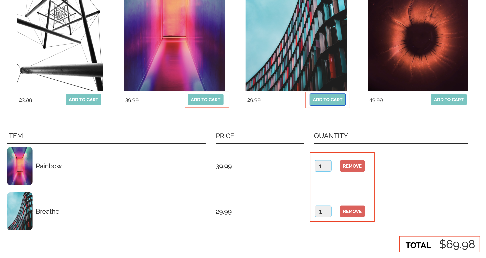
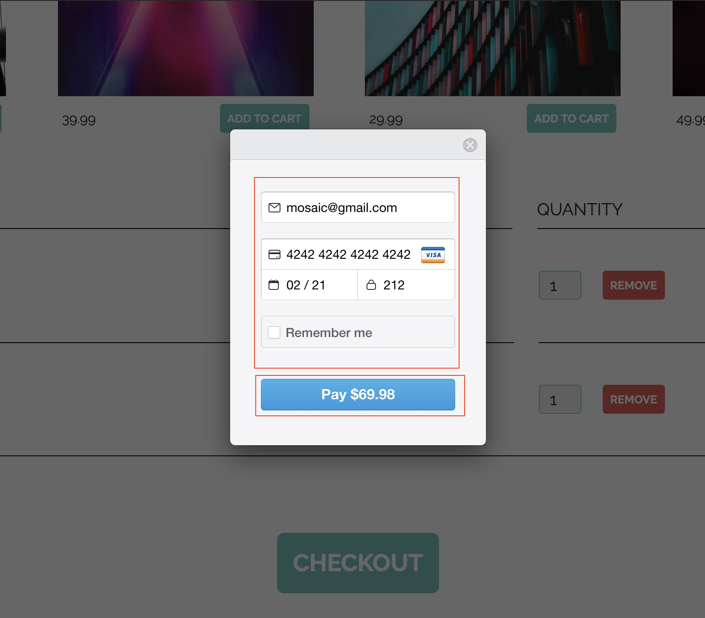
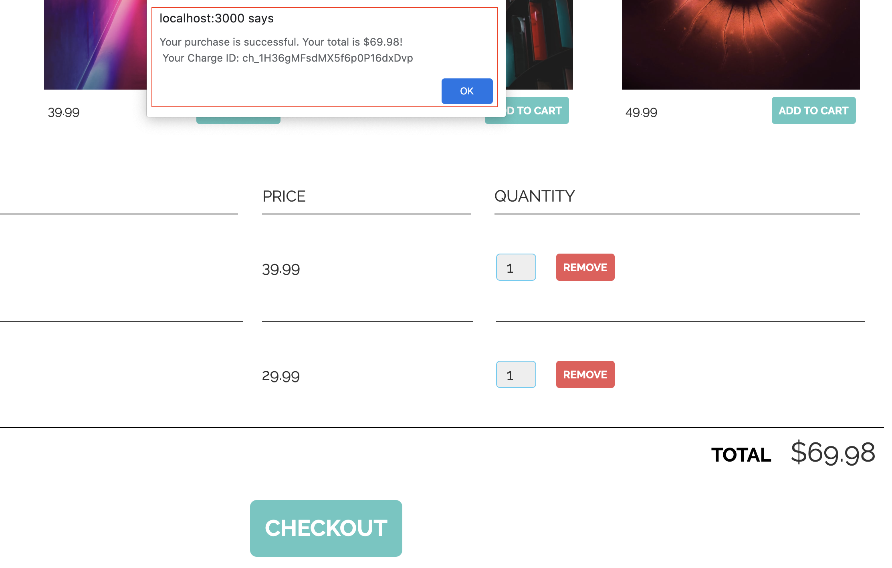

# E-commerce App Using Node.JS and Stripe Checkout

## Application Overview 

Utilizing the [Charges](https://stripe.com/docs/api/charges) and [Tokens](https://stripe.com/docs/api/tokens) APIs, this Express app allows users to accept payments through Stripe [Checkout](https://stripe.com/docs/payments/checkout). Upon a successful payment, the app returns a JSON response displaying the total amount of the charge and Stripe charge Id.

#### Design Approach:

1. User clicks on the ‘Add to Cart’ button to add selected items to a cart at the bottom of the page. Users can modify item quantity, remove item, or add additional items.



2. User clicks on the ‘Checkout’ button. This prompts the user to enter his/her payment information in the Strip Checkout pop-up. 
The Checkout pop-up will collect the user’s information and send it to Stripe. Stripe will then parse this information, tokenize it, and send the token to the server we created in this sample application. Using the token and the secret API key, we can then create charges on the server. 
Once the charge is created, you can confirm that the total amount the user paid is the same as the amount they are being charged through the Stripe Dashboard.



</b>
</b>
</b>

3. User will receive a payment confirmation displaying the total amount of the charge and Stripe charge Id.



</b>
</b>
4. User clicks OK to reset cart to $0. 

</b>
</b>


### Run App Locally:


1. Clone app from Github

```
https://github.com/kebedemeron905/express-stripe.git
```


2. Install dependencies

```
npm install --save express ejs stripe
```

3. Run the application

```
node server.js
```

4. Go to `localhost:3000` to add items to cart, checkout, and receive payment confirmation

</br>
</br>

## Language/Frameworks Used

* [EJS](https://ejs.co/)
* [Node.js](https://nodejs.org/en/about/)
* [Express](https://expressjs.com/)

Node.js allows me to build server-side applications in JavaScript. Thus, it was my language of choice. I chose Express as my web framework for multiple reasons: it is a minimalist framework; it is the most common framework used for developing Node.js; it makes Node.js app development fast and easy; and, it easily integrates with different template engines like EJS. Lastly, I chose EJS as my view templating language because it allows me to put server side code in my html.

</br>

## How to Extend App 

I want to extend this app with the intent of providing users a seamless and end-to-end payment experience. Thus, I want the app to include authentication, automatic emails with payment receipts, or a refund feature. 

