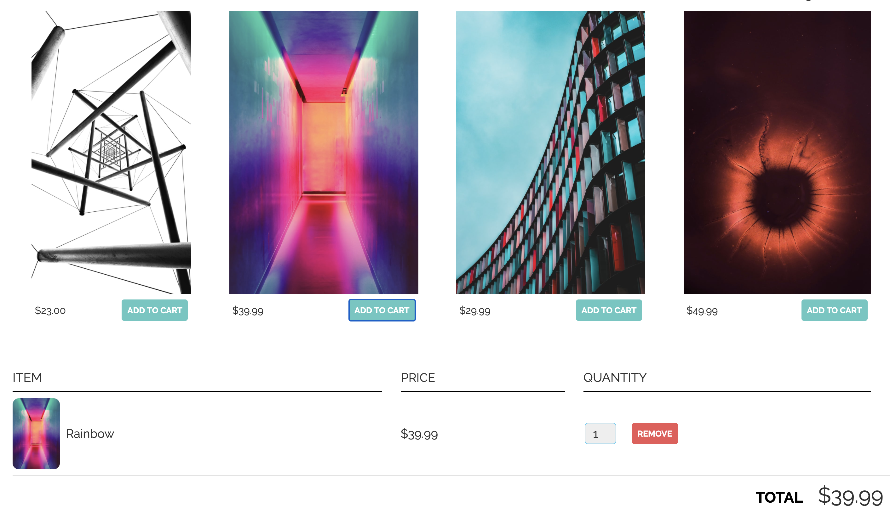

# E-commerce App Using Node.JS and Stripe Checkout



## Application Overview 

Utilizing the Charges and Tokens APIs, this Express app allows users to accept payments using Stripe Checkout. 
</br>

[Checkout](https://stripe.com/docs/payments/checkout)

### How Does it Work


1. Install dependencies

```
npm install 
```

2. Run the application

```
node server.js
```

3. Go to `localhost:3000` to see application

## Design Approach


## Language/Frameworks Used


## How to Extend App with Stripe